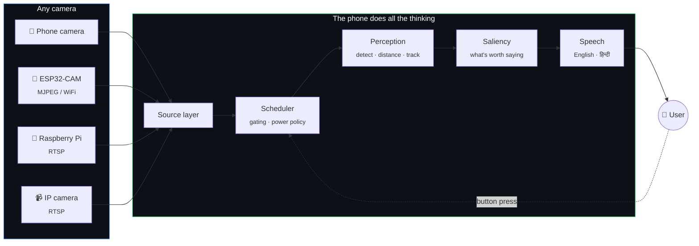
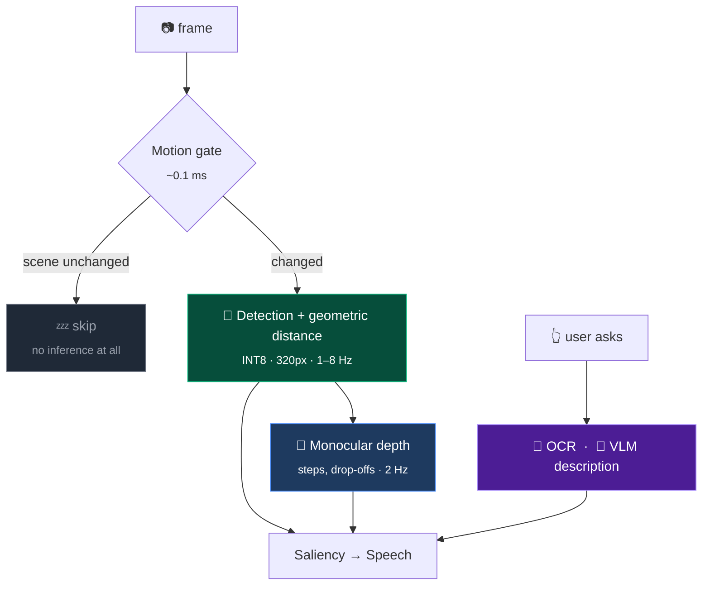
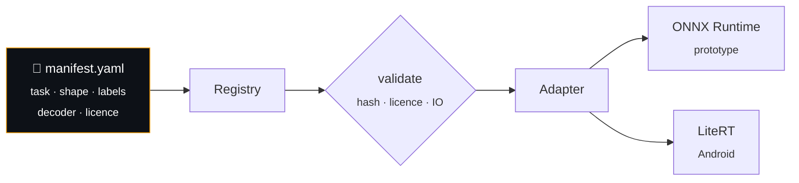

<div align="center">

# सारथी · Sarathi

**A phone that tells you what's in front of you.**

Real-time assistive scene understanding for blind and low-vision users.
Fully offline. Runs on a mid-range Android phone.

[](LICENSE)
[](prototype/pyproject.toml)
[](docs/08-android.md)
[](#roadmap)
[](#design-constraints)

</div>

---

*Sarathi* (सारथी) is the charioteer — the one who watches the road and tells you
what's coming. The name is deliberate: this tool doesn't restore sight, it
guides.

## What you hear

The phone is in a pocket or on a lanyard. **The screen is off.** You hear:

```
                         ♪  (soft rising tone)
  walking                "Step down ahead."
                         "Chair, two o'clock, one and a half metres."
                          … silence …
                         "Person approaching, twelve o'clock."

  press volume-up        "Door reads: Lab 204."

  hold volume-up         "A corridor with a doorway on the left
                          and two people walking towards you."
```

The silence matters as much as the speech. Constant narration is the single
most common reason people abandon assistive vision tools — so Sarathi speaks
only when something is worth saying.

## How it works



External cameras are **dumb sources** — an ESP32 can't run a detector, and a Pi
that could would need its own battery, thermals and update path. Keeping all
inference on the phone means one pipeline, one optimization story, and hardware
the user already charges every night.

### Three tiers, because battery is the real constraint

Running one model on every frame either burns the battery or gives bad
guidance. So work is split by **how often it actually has to happen**:



| Tier | Runs | Why it's separated |
|---|---|---|
| **0 · Motion gate** | Every frame, ~0.1 ms | A stationary user pointed at a static scene needs *no inference*. Frame-differencing a 64×64 downscale is nearly free and eliminates most frames in indoor use. |
| **1 · Detection + distance** | Gated, 1–8 Hz | The product. Distance comes from box geometry and a ground-plane assumption — far cheaper than a depth net, and accurate enough to say "about a metre and a half". Nobody needs more precision spoken aloud. |
| **2 · Depth** | 2 Hz, while moving | Steps, kerbs and drop-offs have no bounding box to reason from. That genuinely needs depth — but only a few times a second. |
| **3 · OCR / VLM** | Only when asked | A VLM costs orders of magnitude more than the detector. Behind a button, its cost is bounded by how often you press it. |

## Design constraints

Not defaults — these come from the users, and the architecture is shaped around them.

| | |
|---|---|
| 🔒 **Fully offline** | Works in a basement, on a train, with no data balance. No per-user cost. Video never leaves the phone. |
| 🔋 **Battery before accuracy** | An aid that dies at 2 pm is not an aid. |
| 🤫 **Silence is a feature** | Speaks when there's something worth saying. Otherwise, nothing. |
| 📷 **Any camera** | Phone, ESP32, Pi or IP camera — same pipeline, no code changes. |
| 🔄 **Swappable models** | Models are manifests, not code. A new model is a download, not an app update. |
| 🌓 **Screen off** | The display is the biggest power draw on the device and useless to the primary user. Everything is driven by hardware buttons. |

## Model swapping

The requirement that shaped the most design: **models must be replaceable
without touching code**, including models that don't exist yet.



The **same manifest is read by the Python prototype and the Android app** — so a
model benchmarked on a laptop drops into the phone unchanged, and the numbers in
the docs stay meaningful across the port. Swapping in a new detector, or a
future Gemma vision model, is a manifest and a download.

## Measured

Real numbers only. Every figure names the device that produced it; anything not
yet measured says so rather than quoting a datasheet.

| Source | Device | Resolution | Effective fps | Interval p50 / p95 | Jitter |
|---|---|---|---|---|---|
| Webcam | M3 MacBook, built-in | 1280×720 | 29.3 | 33.4 / 36.8 ms | 1.7 ms |
| Video file (realtime) | M3 MacBook | 640×480 | 30.6 | 33.3 / 36.6 ms | 3.8 ms |
| ESP32-CAM | — | — | *not yet hardware-tested* | | |
| RTSP (Pi / IP cam) | — | — | *not yet hardware-tested* | | |

> **No unmeasured numbers.** Benchmark tables elsewhere in `docs/` are
> deliberately empty until the measurement exists. No latency or battery
> *targets* are set yet either — targets invented before measuring are guesses
> that get quietly relaxed later.

## See it running

The fastest way to understand what this does is to watch it. The desktop app
drives the **real pipeline** — same detector, same geometry, same saliency and
phrasing that run on the phone, reading the same manifests — and draws what it
sees:

**Double-click `run-desktop.command`** in the repository root. That is the whole
setup — it handles the path, checks the virtualenv, and starts the camera.

From a terminal, note the quotes: the repository path contains a space, and
without them the shell reports a missing directory rather than a quoting
problem.

```bash
cd "path/to/STM Vission App/prototype"
.venv/bin/python -m sarathi.desktop                     # your webcam
.venv/bin/python -m sarathi.desktop --source walk.mp4   # a recorded walk
.venv/bin/python -m sarathi.desktop --speak             # with the voice
.venv/bin/python -m sarathi.desktop --no-autostart      # open idle
```

Boxes coloured by hazard, the distance it computed, what it chose to say and
what it stayed quiet about, and the numbers behind the decision.

Two buttons run the on-demand tiers, the same ones the phone puts on volume-up:

- **Describe scene** — Gemma 4 E2B locally. 4.8 s to load, then 2.7 s an answer.
- **Read text** — OCR on a sign, a door number, a label.

Neither is on the safety path. Hazards come from the detector, which is bounded
and measured; a language model is wrong in fluent, confident prose, which is the
worst failure mode available to someone who cannot check it.

This is not a toy viewer. It earns its place by catching things logs cannot:
a detector fed sideways frames reports "0 detections", which is also what an
empty room reports — but a picture with no boxes on an obvious doorway is
unmistakable. The first minute it existed it exposed a wall clock being
reported at 54.3 metres.

## Quickstart

```bash
git clone https://github.com/thesid16/sarathi.git
cd sarathi/prototype

uv venv --python 3.12 .venv
uv pip install -e ".[dev]"

# Is the camera actually delivering frames?
.venv/bin/python -m sarathi.cli probe --source 0                            # local webcam
.venv/bin/python -m sarathi.cli probe --source http://192.168.4.1:81/stream # ESP32-CAM
.venv/bin/python -m sarathi.cli probe --source rtsp://192.168.1.60:8554/cam # Pi / IP camera

.venv/bin/python -m pytest tests/ -q
```

`probe` reports resolution, effective frame rate, interval distribution and
jitter — run it first whenever a feed misbehaves. Most "the app feels laggy"
reports on a wireless camera turn out to be the *link*, not the model, and this
tells the two apart in ten seconds.

<details>
<summary><b>Example output</b></summary>

```
  source          file  (file)
  open latency    2 ms
  resolution      640x480
  frames          90 captured, 0 dropped
  effective fps   30.6
  frame interval  min 0.2 / p50 33.3 / p95 37.0 / max 38.2 ms
  jitter (sd)     3.9 ms
```
</details>

## Two policies enforced for every camera, once

**Drop, don't queue.** If inference is slower than capture, intermediate frames
are discarded rather than buffered. A queue would show healthy throughput while
guidance drifted further behind reality — describing a scene the user has
already walked through. For an assistive product that's a safety defect, not a
performance one.

**Reconnect, don't die.** WiFi roams; an ESP32 browns out under load. Failures
trigger reconnection with exponential backoff rather than ending the session — a
blind user can't notice the app went quiet and restart it.

Both live in one wrapper class, so they're identical across every transport,
including ones added later.

## On smart glasses

Meta's Ray-Ban glasses **do not** expose a real-time camera feed to third-party
apps. The wearables developer toolkit is preview-only and doesn't provide the
continuous frame access this needs. No plan here assumes glasses support.

The camera layer is a plugin registry regardless, so if such an API opens,
glasses become one new `FrameSource` subclass and one line in a dict — with no
change to anything else.

## Repository layout

```
prototype/          Python pipeline — where behaviour is designed and proven
  sarathi/
    sources/          camera plugins  (webcam · MJPEG · RTSP · file)
    models/           manifest-driven model registry
    perception/       detection · distance · tracking
    guidance/         saliency · phrasing · speech
    runtime/          scheduler · gating · power policy
    bench/            measurement harness
training/           fine-tuning pipeline (runs on a GPU server)
models/manifests/   model manifests (weights are not committed)
android/            Kotlin app — ported once behaviour is proven
docs/               full technical documentation
```

Behaviour is designed in Python because mistakes are cheap there. Tuning a
saliency threshold is a two-second edit and a re-run; on Android it's a rebuild,
reinstall and walk around the building.

## Roadmap

- [x] **Phase 0** — repo, config, camera source layer, capture benchmarking
- [x] **Phase 1** — model registry, detection, geometric distance, tracking
- [x] **Phase 2** — saliency, phrasing, speech: the first genuinely usable walk
- [x] **Phase 3** — power policy: motion gating, adaptive rate, thermal governor
- [x] **Phase 4** — on-demand OCR and VLM scene description
- [x] **Phase 5** — taxonomy, dataset, fine-tuning, quantized export
- [x] **Phase 6** — Android app (Pixel 8a · Tensor G3)
- [ ] **Phase 7** — evaluation walk with a blind user, full benchmark set

## Measured on a Pixel 8a

Everything below was read off the device, not estimated. Reproduce any of it
with `adb logcat -s SarathiService SarathiDelegate SarathiVLM SarathiOCR`.

| | |
|---|---:|
| Detection | **33 ms** per frame, YOLO11n 320 px, dynamic-range INT8 |
| Frames reaching the model while walking | ~18% (motion gate + rate limit) |
| Detector accuracy | mAP50 **0.597** over 26 classes, held out by source |
| stairs\_up / stairs\_down / open\_manhole recall | **0.983 / 0.950 / 0.930** |
| Text reading | **720 ms**, 4 of 4 blocks |
| Scene description | **3.6 s** warm, 4.4 s to load the engine |
| App memory, guidance only | **182 MB** |

Three results were worth more than the numbers themselves:

**Quantization.** Full INT8 is the fastest variant available and detects
nothing — the class head collapses to 0.0000 while the box rows still peak at
333.8, because post-sigmoid scores occupy a range a per-tensor int8 scale
rounds to zero. Dynamic-range quantization is 3.7× smaller, 3–4× faster and
numerically equivalent. [→](docs/03-optimization.md)

**The GPU is faster and wrong.** It takes all 377 nodes, runs at roughly twice
the CPU's speed, and returns a tensor deviating by up to 264.5 where the
reference value is 43.5. It was rejected by an agreement check that compares
every candidate backend against the CPU on a real image — without which this
would have shipped as an app that felt fast and silently detected nothing.
[→](docs/03-optimization.md)

**A desk is not a worse floor than a floor.** The depth tier's flat-ground fit
is scale-invariant, which is what makes it safe on a depth model with no units
— and is exactly why it cannot tell which plane it is looking at. A floor at
1.2 m and a desk at 0.45 m both fit at 1.0000. Fixed by anchoring the scale to
a detection's measured distance rather than by tuning a threshold.
[→](docs/01-architecture.md)

## Documentation

| | |
|---|---|
| [Overview](docs/00-overview.md) | Product, users, requirements, how success is judged |
| [Architecture](docs/01-architecture.md) | System design, frame lifecycle, threading, power policy |
| [Model selection](docs/02-model-selection.md) | Candidates, licence analysis, benchmark plan |
| [Optimization](docs/03-optimization.md) | Every measure with before/after, including the GPU delegate that was rejected |
| [Scene description](docs/05-vlm.md) | Gemma 4 E2B on device: latency, memory, and the build that cannot see |
| [Text reading](docs/06-ocr.md) | OCR, the recogniser comparison, and the licence trade made knowingly |
| [Results](docs/07-results.md) | Held-out detector accuracy, per class |
| [Baseline](docs/08-baseline.md) | Where the time goes, per stage and per model |
| [Engineering report](docs/assets/report.html) | The whole project on one page, with every measured number |
| [Datasets](docs/04-datasets.md) | Every source with its licence, and how the domain gap gets closed without collecting data |
| [ADRs](docs/adr/) | Decision records, including the options rejected and why |

### Training data

All training data comes from public sources — **nothing is collected with a
camera.** Every source is listed with its licence in
[`docs/04-datasets.md`](docs/04-datasets.md), and attribution is generated from
the dataset configs so it can't drift.

The hard part isn't finding objects, it's finding them from the right
*viewpoint*: a driving dataset sees an auto-rickshaw through a car windscreen,
not from a footpath at two metres. The plan leans on
[WOTR](https://github.com/kxzr/WOTR) (MIT, ~190k objects, pedestrian view) and
closes the remaining geographic gap with Mapillary's CC BY-SA street imagery
plus open-vocabulary auto-labelling. Derived annotations get published back
under the same licence.

## Licence

**AGPL-3.0.** Anything built on Sarathi stays open — which is the point.

Model weights carry their own separate terms. Non-commercial-licensed models
(e.g. Depth Anything V2 Base/Large, CC-BY-NC) are **excluded on purpose**: they
would restrict the students, NGOs and researchers this project exists for.
Large models — Gemma 4 E2B, for instance — are offered as optional
user-downloaded packs rather than bundled, because a multi-gigabyte download
would make the app uninstallable for users on 4 GB phones and metered
connections. That is a size decision, not a licensing one: Gemma 4 is
Apache-2.0. See [`docs/02-model-selection.md`](docs/02-model-selection.md).

## Acknowledgements

Developed by [Siddharth Patel](https://github.com/thesid16) during an
internship at STMicroelectronics. This is an independent open-source project —
it is not an STMicroelectronics product and carries no endorsement from them.

Built for the people who'll use it. If you work in accessibility and something
here is wrong, please open an issue — being corrected is cheaper than shipping
a bad aid.

## Get it

| | |
|---|---|
| **Read it online** | **[thesid16.github.io/sarathi](https://thesid16.github.io/sarathi/)** — the engineering report, with a [live browser demo](https://thesid16.github.io/sarathi/demo/) |
| **Android** | [`sarathi.apk`](sarathi.apk) — install and it starts. [Full instructions](INSTALL.md) |
| **Browser** | `cd web && python3 -m http.server 8000` — no install, video never leaves the device |
| **Desktop** | double-click `run-desktop.command` — the real pipeline in a window |
| **Changing it** | [Edit guide](docs/09-edit-guide.md) — what to edit, what to run, what will bite you |
