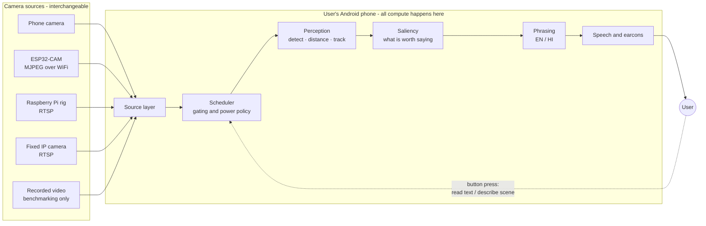
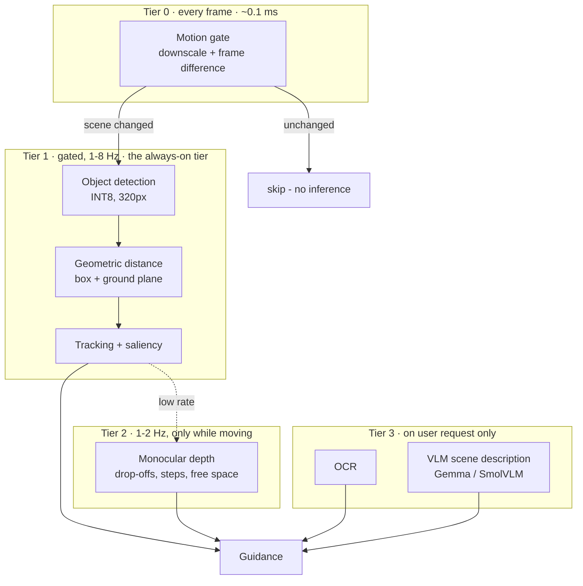
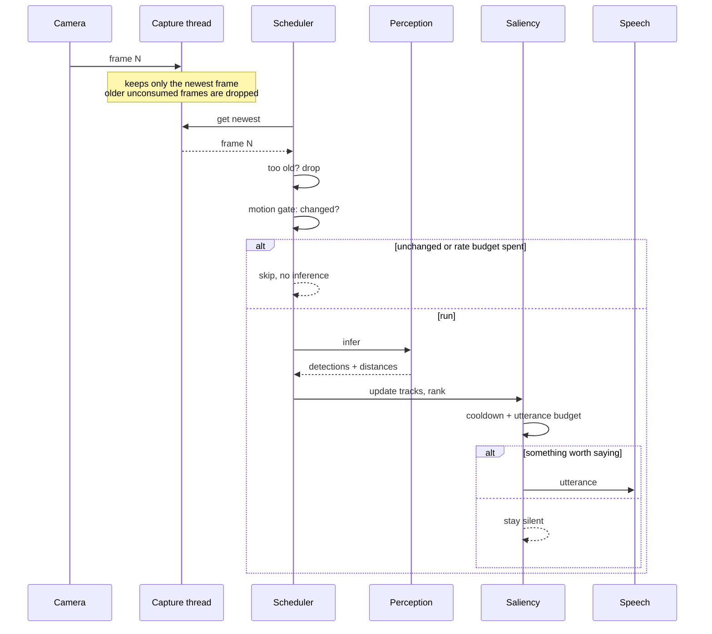
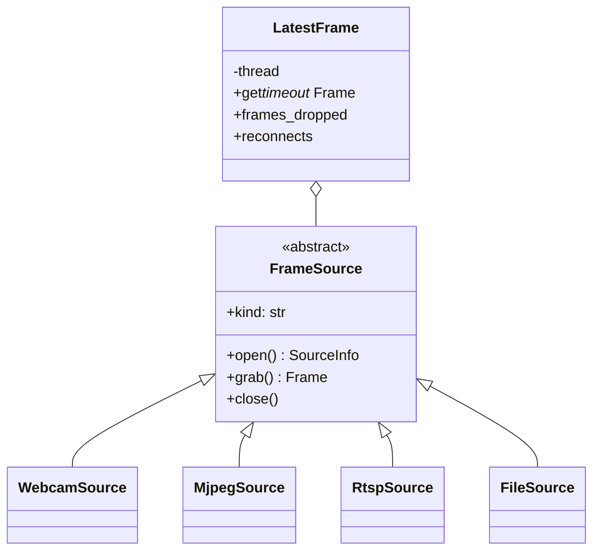
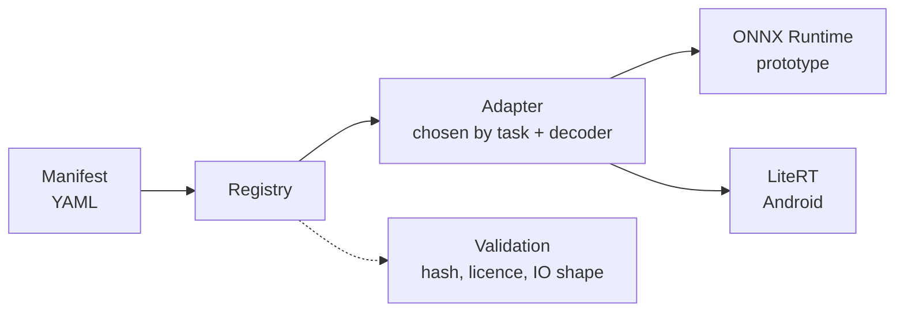
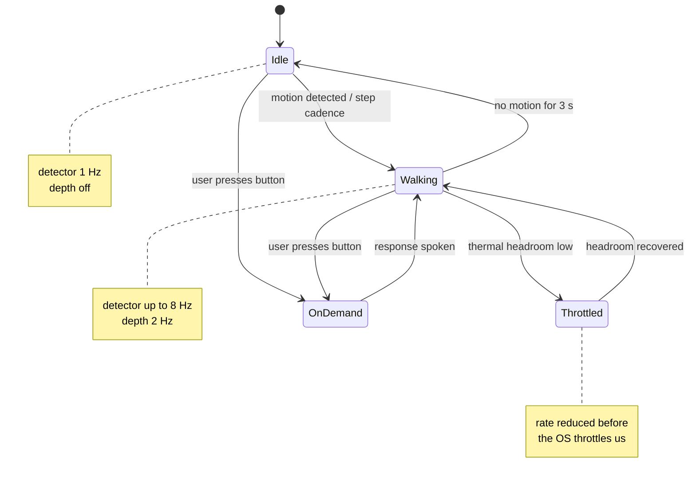
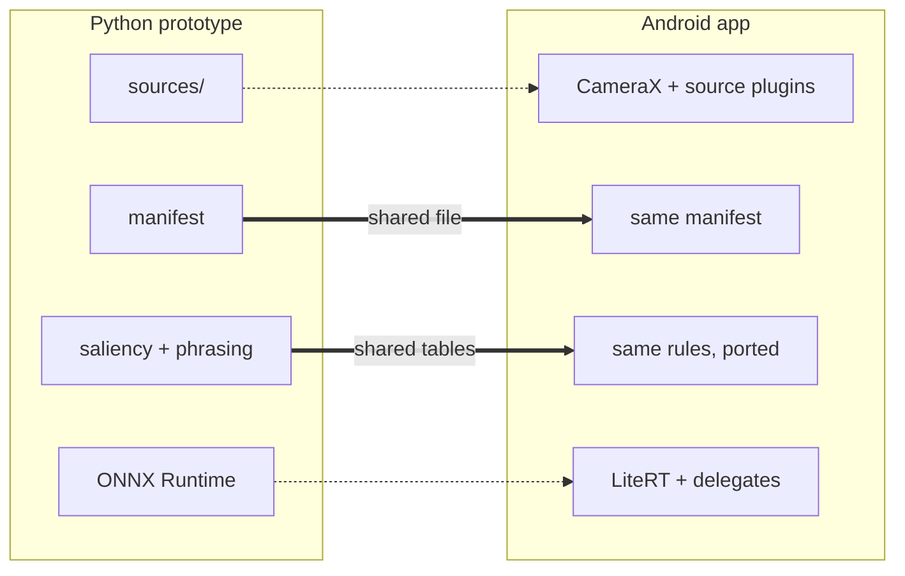
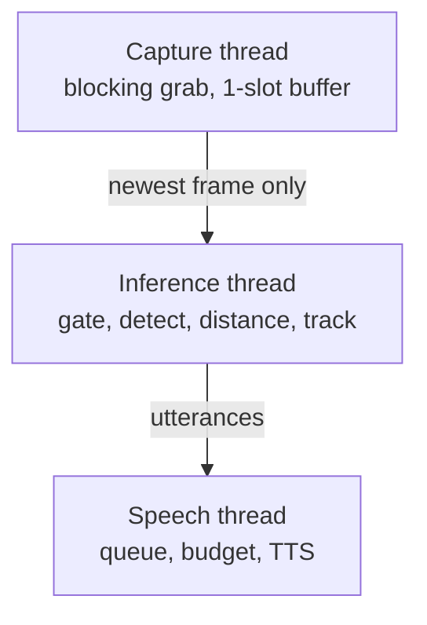

# Architecture

> Status: the camera layer described here is built and tested. Everything
> downstream is designed but not yet implemented. Sections are marked
> accordingly.

## 1. System context



Two properties of this diagram carry most of the design:

**The phone is always the computer.** External cameras are dumb sources. An
ESP32 cannot run a detector, and a Pi that could would need its own battery,
thermal budget and update path. Keeping all inference on the phone means one
model pipeline, one optimization story, and one thing to update — and the phone
is hardware the user already owns and already charges nightly.

**The user talks back.** OCR and scene description are not things the system
decides to do; they are things the user asks for. That is what keeps the
expensive models out of the always-on power budget.

## 2. The three-tier processing model

The single most important structural decision. Running one model on every frame
either burns the battery (if the model is good) or gives poor guidance (if it
is cheap). Instead, work is split by *how often it must happen*:



Why this shape:

- **Tier 0 is nearly free and cuts the most.** A stationary user pointed at a
  static scene needs no inference at all. Frame differencing on a 64×64
  greyscale downscale costs microseconds and eliminates the majority of frames
  in indoor, stationary use — which is a large share of real usage.
- **Tier 1 is the product.** Detection plus a *geometric* distance estimate,
  not a depth network. Distance from box geometry and a ground-plane
  assumption is far cheaper than a depth pass and is accurate enough to say
  "about one and a half metres". Precision beyond that is not useful to speak
  aloud anyway.
- **Tier 2 buys what geometry cannot.** Drop-offs, steps and unlabelled
  obstacles have no bounding box to reason from. That genuinely needs depth —
  but only a few times a second, and only when the user is moving.
- **Tier 3 never runs unasked.** A VLM is orders of magnitude more expensive
  than the detector. Behind a button, its cost is bounded by how often the user
  presses it.

## 3. Frame lifecycle



### Drop, don't queue

Enforced once, in `LatestFrame`, for every source. If inference takes 120 ms
and the camera delivers every 33 ms, the three frames that arrived meanwhile
are discarded rather than queued.

This matters more than it looks. A queue would show healthy throughput while
the guidance fell steadily further behind reality — the system would describe a
scene the user had already walked through. For an assistive product that is a
safety defect, not a performance one. Frames older than
`runtime.max_frame_age_ms` (default 250 ms) are dropped even after being
retrieved.

`LatestFrame` also counts dropped frames, which is how the benchmark harness
distinguishes a capture-bound pipeline from an inference-bound one.

## 4. Camera source layer — *built*



A concrete source implements three methods and nothing else. Threading,
staleness, drop policy and reconnection live in `LatestFrame` and are therefore
identical across every transport — including transports added later.

Adding a camera type is one subclass plus one line in `sources/__init__.py`.

**Reconnection is mandatory, not optional.** WiFi roams and an ESP32 browns out
under load. On failure the wrapper reconnects with exponential backoff and
reports the gap, rather than ending the session — a blind user cannot be
expected to notice the app went quiet and restart it.

**MJPEG is parsed by hand rather than through OpenCV.** OpenCV can open an
MJPEG URL, but it goes through FFmpeg, buffers, and gives no visibility into
what the stream is doing. Since the ESP32 is the least reliable link in the
chain, its failures need to be observable rather than appearing as a frozen
picture. The hand-rolled parser handles both `Content-Length`-delimited parts
and firmwares that omit it, via JPEG marker scanning.

**RTSP defaults are wrong for this use case and are overridden.** FFmpeg tunes
for smooth playback, buffering up to a second of video to avoid a stutter.
Here, latency beats smoothness, so `nobuffer`, `low_delay` and a one-frame
capture buffer are forced.

### Measured

| Source | Device | Resolution | Effective fps | Interval p50 / p95 | Jitter (sd) |
|---|---|---|---|---|---|
| Webcam | M3 MacBook, built-in | 1280×720 | 29.3 | 33.4 / 36.8 ms | 1.7 ms |
| File (realtime) | M3 MacBook | 640×480 | 30.6 | 33.3 / 36.6 ms | 3.8 ms |

ESP32-CAM and RTSP paths are implemented but have not been run against
hardware yet, so no numbers are quoted for them.

## 5. Model registry — *designed, not built*

The requirement is that models can be swapped without touching code, including
models that do not exist yet. The mechanism is a declarative manifest:

```yaml
id: detector-v1
task: detection
license: Apache-2.0
distribution: bundled          # bundled | user_download | excluded
runtime: {prototype: onnxruntime, android: litert}
files: {onnx: ..., tflite: ..., sha256: ...}
input: {width: 320, height: 320, color: RGB, dtype: uint8, resize: letterbox}
output: {decoder: yolox, labels: labels/stm70.txt, conf_threshold: 0.35}
delegates: [qnn, gpu, xnnpack]   # Android preference order
```



Three consequences worth stating explicitly, because they are the reason for
the indirection:

1. **The same manifest is read by the prototype and the Android app.** A model
   benchmarked on the Mac drops into the phone with no code change, so the
   numbers in the documentation stay meaningful across the port.
2. **New models ship as model packs, not app updates.** Adding a future Gemma
   vision model is a download, not a release cycle. This is the requirement
   that most shaped this design.
3. **Licence is a field, and it is checked.** A model marked `excluded` refuses
   to load; one marked `user_download` is never committed or bundled, so its
   terms stay between the user and whoever published it. Sarathi is AGPL-3.0,
   so the constraint is not "can we use this" but "does bundling it restrict
   the people downstream" — see [`02-model-selection.md`](02-model-selection.md).

## 6. Power policy — *designed, not built*

The battery story is not one trick; it is a stack of them, each with a measured
before/after in [`03-optimization.md`](03-optimization.md) once implemented.



Planned measures, in expected order of impact:

| # | Measure | Mechanism |
|---|---|---|
| 1 | Motion gating | Skip inference entirely when the scene is static |
| 2 | Adaptive rate | IMU step cadence drives detector Hz: 1 Hz idle → 8 Hz walking |
| 3 | INT8 quantization | Per-channel PTQ; QAT only if PTQ accuracy loss is unacceptable |
| 4 | Delegate cascade | NPU → GPU → XNNPACK, auto-benchmarked on first run |
| 5 | Tier separation | Depth at 2 Hz, VLM only on request |
| 6 | Screen off | Foreground service; hardware-button triggers, no screen needed |
| 7 | Thermal governor | Degrade rate before the OS throttles, using thermal headroom |
| 8 | Zero-copy input | YUV → tensor without per-frame bitmap allocation |

Measure 6 deserves emphasis: for this user the screen is pure waste. An
always-on 6-inch display can consume more power than the inference does. The
app is designed to be operated entirely with the volume and headset buttons,
screen dark.

## 7. Guidance layer — *designed, not built*

Perception produces dozens of detections per frame. Speaking them is useless.
The saliency stage decides what is worth saying, ranked by:

- **proximity** — nearer matters more, non-linearly;
- **path intersection** — an object in the walking corridor matters far more
  than one at the same distance off to the side;
- **hazard class** — a descending staircase outranks a sofa regardless of
  geometry;
- **novelty** — objects already announced are suppressed by a cooldown keyed on
  the tracked object, not on the sentence, so a chair whose distance updates
  does not get announced twice.

Then a hard utterance budget (default: no more than one utterance per 1.5 s)
and a fixed phrasing grammar: `<object>, <clock bearing>, <distance>`. Urgent
hazards pre-empt with a non-speech earcon first, because a rising tone reaches
the user several hundred milliseconds before a spoken word can.

Phrasing is table-driven so English and Hindi differ only in data, not code.
The Hindi object lexicon is hand-curated — machine translation produces object
names that are technically correct and unnatural to hear repeatedly.

## 8. Prototype to Android



The prototype exists to make behavioural mistakes cheaply. Tuning a saliency
threshold is a two-second edit in Python and a rebuild-install-walk-around cycle
on Android. What crosses the boundary unchanged is the *data*: model manifests
and phrasing tables. What gets reimplemented is the *plumbing*: capture and
inference runtime.

## 9. Threading



Three threads, one direction of flow, no shared mutable state beyond the
one-slot frame buffer and the utterance queue. Capture must never block on
inference — if it did, a slow model would corrupt the frame timing that every
latency measurement depends on.

---

## Known limitations

Found by running the real pipeline on real footage, not predicted:

### Occlusion silently breaks the ground-plane estimate

The ground-plane estimator assumes the bottom of a bounding box is where the
object meets the floor. Measured against a live webcam, a **seated** person
roughly 0.7 m away was reported at a very stable 2.78 m — stable to ±0.02 m
across 36 consecutive frames, and confidently wrong.

The cause is that the person's lower body was behind a desk. The box bottom was
the desk edge, not their feet, so the geometry answered the question it was
asked correctly and the question was wrong.

Why the existing safeguards did not catch it:

- The **truncation bound** only fires when the box touches the frame edge. Here
  the box ended well inside the frame, so nothing looked unusual.
- The **cross-check against the size prior** did not disagree either: a seated
  person's visible height also reads as "further away", so both estimators were
  wrong in the same direction and their agreement was taken as confidence. The
  first few frames were even reported as `fused`, the highest-confidence source.

This matters beyond desks. On an Indian footpath the common case is a person
partly behind a parked scooter, a bollard behind a stall, a kerb behind a
puddle. All of them present a box bottom that is not the ground contact.

Mitigations, in order of how much they would actually help:

1. **The depth tier.** This is precisely what Tier 2 exists for — a monocular
   depth reading at the box location does not care what the box bottom means.
2. **Treat agreement between two estimators sharing an assumption as weaker
   evidence than it currently is.** Both estimators depend on seeing the whole
   object; when both are wrong they are wrong together.
3. **Ground-plane consistency across a track.** A stationary object whose
   apparent ground contact never changes while the user walks toward it is not
   resting where it appears to.

Recorded rather than fixed, because the honest fix is the depth tier and that
is a separate piece of work.

### The depth tier is unvalidated on real floors, and is off by default

The floor analysis passes its tests against synthetic geometry, correctly
detects drop-offs and steps, and is scale-invariant to the depth model's
arbitrary output range. None of that means it works.

Pointed at a real scene — a desk, a person, a wall — it announced **"step down
ahead" four times in fifteen seconds**. There was no step. The `fit_quality`
gate did not catch it: a desk surface fits a flat-ground model perfectly well,
returning 0.85–0.88, comfortably over the 0.80 trust threshold. A smooth
surface that is not floor looks exactly like floor to this analysis.

False drop-off alerts are the worst failure mode this system has. Someone stops
or stumbles for nothing, and then stops trusting the one warning that matters.

Three fixes went in, and one problem remains open:

**Fixed — a desk is not a worse floor, it is an equally good plane.**

This turned out not to be a threshold that needed tuning. It was a limit, and
the limit is visible in one line of algebra. Relative depth gives

```
observed(y) = s · (1 / d(y)) + t          # s, t unknown: the model has no units
1 / d(y)    = tan(depression) / h         # a horizontal plane at height h

⇒  observed(y) = (s / h) · tan(depression) + t
```

The fit measures `s / h`. Two unknowns, one equation, so **h cannot be
recovered from the plane at all**: halve the surface height, halve the depth
model's scale, and the depth maps are byte-identical. The scale invariance that
makes this analysis safe on an unknown depth model is exactly what makes it
blind to which plane it is looking at.

Measured, against synthetic ground truth:

| surface | fit_quality | verdict |
|---|---:|---|
| floor, 1.2 m below camera | **1.0000** | flat |
| desk, 0.45 m below camera | **1.0000** | flat |
| desk, 0.45 m, 4× depth scale | **1.0000** | flat |

No threshold separates those, at any quality. So the scale now comes from
outside the depth map, from something this project already computes: the
geometric estimator's metres to a detected object standing on the ground. One
such distance pins `s`, and the surface height follows —

```
s = (anchor_depth − intercept) × anchor_distance
h = s / slope
```

— after which a desk at 0.45 m and a floor at 1.2 m are trivially different
numbers. `trustworthy` now requires both that the near field is flat *and*
that it sits about where the floor should be. With no detection to anchor
against, there is no metric scale, and `trustworthy` is False. Unknown does
not read as floor.

The band is 0.78–1.35 × the configured mount height, and it is set by which
error is cheaper rather than centred on the truth. A rejected floor is
silence, which is what this tier does today anyway. An accepted desk is a
confident warning about a step that is not there. So the band is tightened
until the cheap mistake is the common one — and a phone carried much lower
than configured is a known, deliberate false negative rather than a guess.

**Fixed — fake confirmation.** A ground reading stays valid for ~1.2 s while
depth runs at ~2 Hz, so the same measurement was re-injected as a detection on
every frame in between. The tracker saw it repeatedly, `min_hits` was satisfied
within two frames, and the confirmation was one measurement wearing a disguise.
Now three *independent* depth passes must agree, and agree about *where*; a
pass that sees clear floor wipes the record rather than merely not adding to
it.

**Fixed — camera pitch.** The fit needs genuine near-field floor to calibrate
against, and a near-level chest camera has almost none: its nearest visible
ground is over two metres away. Around 20° of downward tilt is now assumed, and
`CameraModel.nearest_visible_ground_m` makes the blind spot explicit.

**Open — "is this actually floor?"** Nothing currently distinguishes a floor
from a desk or a wall. Until it does, the depth tier stays **disabled by
default** (`--depth` is opt-in) and no claim is made about drop-off detection.
Validating it needs real footage of real kerbs, which is what the evaluation
walk is for.

### Synthetic footage cannot validate a detector

A rendered scene of a person-shaped figure approaching was detected as a
"traffic light" four times and a person zero times. Synthetic video is fine for
testing the **scheduler** — frame timing and gating are real regardless of
content — and useless for testing **perception**. The evaluation walk must be
real footage.

## Open design questions

Recorded here rather than silently assumed:

1. **Ground-plane calibration.** Geometric distance needs the camera's height
   and pitch. Fine for the phone in a lanyard; unknown for an arbitrary
   ESP32-CAM clipped to a cap. Likely answer is a short guided calibration
   walk, but this is not yet designed.
2. **Whether the IMU is usable with an external camera.** Step cadence comes
   from the phone's IMU, which still works — the phone is on the user — but the
   camera's motion is no longer the phone's motion. Motion gating may need to
   fall back to pure frame differencing for external sources.
3. **Hindi speech rate.** Android's offline Hindi TTS voices vary in quality by
   device. Needs testing on the actual target phone before committing to
   speech-first urgent alerts in Hindi.
