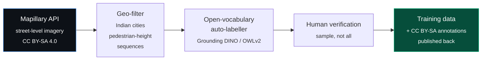

# Datasets

> **Correction to an earlier assessment in this project.** I previously wrote
> that without self-collection the India-specific hazard classes would be
> largely uncoverable. Having actually searched, that was too pessimistic. A
> pedestrian-viewpoint obstacle dataset exists under MIT, open-manhole data
> exists under CC BY 4.0, and Mapillary provides worldwide street-level imagery
> under CC BY-SA with free API access. The gap is real but mostly closeable
> without anyone picking up a camera. This document is the plan.

## 1. The constraint

No data will be collected with a camera. Everything must come from public
sources, and the resulting weights are released under AGPL-3.0, so every
source's licence has to survive that.

Two distinct problems hide inside "we need data":

| Problem | Description | Difficulty |
|---|---|---|
| **Class gap** | The object simply isn't in any dataset (open manhole, tactile paving) | Solved — see §3 |
| **Domain gap** | The class exists but only from the wrong viewpoint or the wrong country (auto-rickshaw seen from a car windscreen, not from a footpath at 2 m) | Harder — see §4 |

The domain gap is the more dangerous of the two, because it produces a model
that scores well on benchmarks and fails on the street. Most of the effort
below goes there.

## 2. Licence compatibility

Sarathi is AGPL-3.0. What matters is whether training on a source and openly
releasing the weights is clean.

| Licence | Verdict | Notes |
|---|---|---|
| MIT / Apache-2.0 / BSD | ✅ Clean | No conditions beyond attribution |
| CC BY 4.0 | ✅ Clean | Attribution required; recorded in `training/ATTRIBUTION.md` |
| CC BY-SA 4.0 | ✅ Clean for us | Share-alike. CC declares BY-SA 4.0 one-way compatible with GPLv3; AGPL-3.0 is a GPLv3 variant, and we publish openly anyway. Derived annotations get shared back under CC BY-SA. |
| CC BY-NC | ❌ Excluded | Would restrict downstream users — the whole point of AGPL here |
| Research-only / custom | ⚠️ Case by case | Usable for *evaluation* even when weight release is unclear |

Anything used gets an entry in `training/ATTRIBUTION.md` with source, licence
and URL. That file is generated from the dataset configs, so it cannot drift.

## 3. Confirmed sources

### Tier A — pedestrian viewpoint, permissive, directly usable

| Dataset | Licence | Size | Why it matters |
|---|---|---|---|
| **[WOTR](https://github.com/kxzr/WOTR)** — Walk On The Road | **MIT** ✅ | ~190,000 objects, 20 classes | **The single most valuable find.** Pedestrian/sidewalk viewpoint, not a car windscreen. Classes: `tactile_paving`, `warning_column`, `roadblock`, `reflective_cone`, `pole`, `ashcan`, `tree`, `crosswalk`, `red_light`, `green_light`, `sign`, `pedestrian`, `bicycle`, `motorcycle`, `car`, `bus`, `truck`, `tricycle`, `dog`, `fire_hydrant`. VOC format. Chinese urban scenes — right viewpoint, wrong country, which is exactly the trade §4 addresses. |
| **[Open-Manholes](https://universe.roboflow.com/aibased-solution-for-realtime-detection-of-road-anomalies-d6eay/open-manholes)** | **CC BY 4.0** ✅ | 677 images | Distinguishes `Open-Manhole` from `Manhole` from `pothole`. The single most dangerous class in the taxonomy, and it exists. |
| **[Pothole and manhole detection](https://universe.roboflow.com/project-auzdn/pothole-and-manhole-detection)** | **CC BY 4.0** ✅ | ~2,500 images | Volume for the same classes. |
| **[RDD2022](https://github.com/sekilab/RoadDamageDetector)** | **CC BY-SA 4.0** ✅ | 47,420 images, 6 countries **incl. India** | Road surface damage: `D40` pothole plus crack classes. Real Indian road surfaces, and the licence is confirmed in the repo. |

### Tier B — broad object coverage

| Dataset | Licence | Value |
|---|---|---|
| **Open Images V7** | Annotations CC BY 4.0; images CC BY 2.0 | 600 classes, far more geographically diverse than COCO. The backbone for everyday objects. |
| **LVIS** | CC BY 4.0 (COCO images) | 1,200 fine-grained classes — carries most of the indoor half of the taxonomy. |
| **COCO** | Annotations CC BY 4.0 | ~30 classes. Reliable, well-understood, over-represented in the West. |

### Tier C — needs a licence check before weight release

| Dataset | Status | Value if usable |
|---|---|---|
| **[IDD](https://idd.insaan.iiit.ac.in/)** — India Driving Dataset | ⚠️ Licence shown only after account login; not determinable remotely. Assume research-only until confirmed. | 34 classes explicitly including `autorickshaw`, `animal`, and unstructured road edges. IIIT Hyderabad + Intel + UCSD. The highest-value single item for Indian content — worth the account. |
| **[SS4Blind](https://github.com/elnino9ykl/SS4Blind)** | ⚠️ No licence stated in repo | Curb segmentation (100 img), crosswalk (191 img), traversability, terrain awareness — all from wearable-camera viewpoint. Small but precisely on-target. Needs an email to the authors. |
| **[StairNet](https://ieee-dataport.org/documents/stairnet-computer-vision-dataset-stair-recognition)** | ⚠️ Requires IEEE DataPort subscription | ~515,000 egocentric images of stairs from a chest-mounted camera, indoor and outdoor. Enormous and exactly the right viewpoint. **Check whether SNU has an IEEE subscription** — if so this is free. |
| **SENSATION-DS** ([arXiv 2607.21137](https://arxiv.org/abs/2607.21137)) | ⚠️ Very recent; release terms unclear | 2,752 image-mask pairs, chest-height pedestrian view, 9-class navigation taxonomy. |
| **Mapillary Vistas** | ❌ Research-only | Has `curb`, `manhole`, `pothole` classes. Excluded — but see §4, the *imagery* is a different licence from the *annotation dataset*. |

### Excluded

Objects365 (unclear terms), Cityscapes (research-only, European anyway),
Mapillary Vistas annotations (research-only).

## 4. The workaround for the domain gap

WOTR gives the right viewpoint from the wrong country. IDD may give the right
country from the wrong viewpoint. Nothing public gives both.

The fix requires no camera work:

**Why this is legitimate and not a hack:**

- **Mapillary imagery is CC BY-SA 4.0 with free API access.** It is worldwide,
  crowd-sourced, and includes substantial Indian coverage. Much of it is
  captured from phones and dashcams at or near pedestrian height.
- **Open-vocabulary detectors label by text prompt.** Grounding DINO and OWLv2
  (both Apache-2.0) will find "auto rickshaw", "open manhole", "parked scooter
  on footpath" without ever having been fine-tuned on them. They are far too
  slow for a phone — which is fine, because they run once, offline, on the lab
  server, as a *labelling* tool rather than a shipped model.
- **Verification is sampled, not exhaustive.** Auto-labels are noisy. The plan
  is to hand-check a random sample per class to get a measured precision
  figure, then either accept the noise (detectors are fairly robust to it) or
  filter by confidence until the sampled precision clears a threshold. That
  precision number goes in the documentation.
- **The output is shared back.** Annotations derived from CC BY-SA imagery get
  published under CC BY-SA with attribution. That satisfies share-alike and
  leaves the next accessibility project better off than we found it.

**Additional levers, cheapest first:**

1. **Copy-paste augmentation** for rare classes — paste verified open-manhole
   and obstacle instances onto varied backgrounds. Well-established for
   long-tail detection and costs nothing.
2. **Photometric domain augmentation** — aggressive colour, haze, glare and
   dust augmentation to push Chinese/Japanese street imagery toward Indian
   visual conditions.
3. **Class remapping over invention.** `tricycle` in WOTR is structurally close
   to a cycle-rickshaw; `warning_column` and `reflective_cone` cover much of
   what "footpath clutter" means in practice. Mapping honestly beats inventing
   a class with 40 examples.

## 5. What remains genuinely uncertain

Stated so the evaluation can report it rather than hide it:

- **Auto-rickshaw at pedestrian range.** IDD has the class but from a vehicle.
  Mapillary plus auto-labelling should cover it; unproven until measured.
- **Indian kerb and footpath step geometry.** Highly variable, poorly
  represented anywhere. The monocular depth tier is the real mitigation here,
  not the detector — geometry does not need a labelled class.
- **Loose cattle at close range.** COCO `cow` exists; close-range street
  context does not. Low frequency, high consequence.
- **Cable and wire clutter.** Thin structures are hard for a 320 px detector
  regardless of data. May be out of reach at this input resolution, and if so
  that will be stated rather than fudged.

Every class that ends up under-covered gets a named entry in the evaluation
report with its measured recall. An assistive tool that silently fails on open
manholes is worse than one that documents that it does.

## 6. Build plan

1. Fix the taxonomy (~70 classes) and write it as a single source of truth.
2. Write per-source ingest adapters that remap each dataset's label space into
   that taxonomy — the mapping is data, not code, and is reviewable.
3. Pull Tier A and Tier B on the lab server. **Nothing downloads to the Mac
   (19 GiB free; COCO alone is ~19 GB).**
4. Resolve the three Tier C licence questions in parallel: IDD account,
   SS4Blind email, IEEE subscription check.
5. Build the Mapillary → auto-label → sample-verify pipeline.
6. Generate `ATTRIBUTION.md` from the configs.
7. Report per-class instance counts before training, so the long tail is
   visible up front rather than discovered in the results.

## 7. Open questions

1. **Does SNU have an IEEE DataPort subscription?** Decides whether 515,000
   egocentric stair images are free or unavailable.
2. **IDD terms** — needs an account to read. Worth doing early.
3. **Mapillary API rate limits** at the volume we need — determines whether
   step 5 takes a day or a week.

## Sources

- [WOTR dataset](https://github.com/kxzr/WOTR) — MIT
- [SS4Blind dataset collection](https://github.com/elnino9ykl/SS4Blind)
- [India Driving Dataset](https://idd.insaan.iiit.ac.in/)
- [RDD2022 / RoadDamageDetector](https://github.com/sekilab/RoadDamageDetector) — CC BY-SA 4.0
- [StairNet, IEEE DataPort](https://ieee-dataport.org/documents/stairnet-computer-vision-dataset-stair-recognition)
- [Open-Manholes, Roboflow Universe](https://universe.roboflow.com/aibased-solution-for-realtime-detection-of-road-anomalies-d6eay/open-manholes) — CC BY 4.0
- [Pothole and manhole detection, Roboflow Universe](https://universe.roboflow.com/project-auzdn/pothole-and-manhole-detection) — CC BY 4.0
- [Mapillary CC BY-SA licensing](https://help.mapillary.com/hc/en-us/articles/115001770409-CC-BY-SA-license-for-open-data)
- [SENSATION-DS, arXiv 2607.21137](https://arxiv.org/abs/2607.21137)
